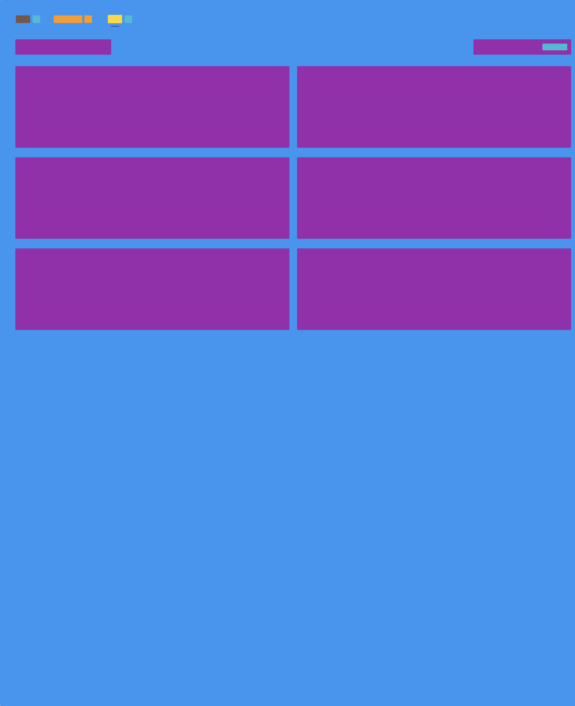
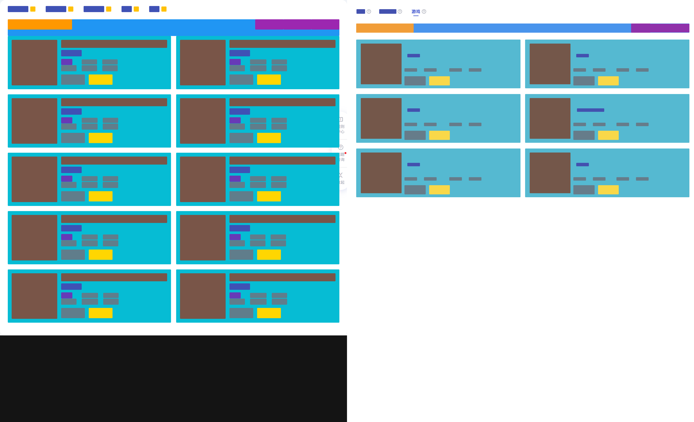
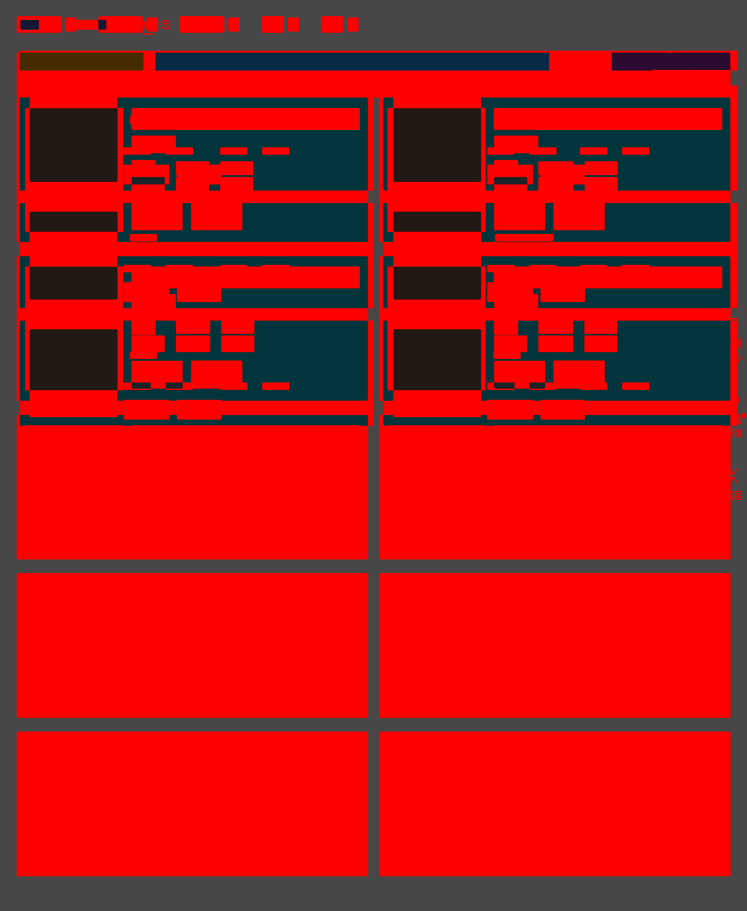
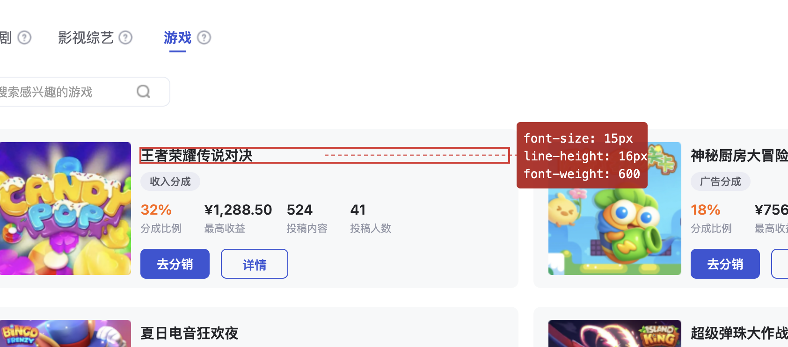

### Figma To Verify

[English](DESIGN.md)

## 基本原理

### 作用

- 从Figma导出指定的Node转为HTML，作为基准。
- 使用浏览器访问真实开发页面，以指定的元素与Figma HTML对齐。
- **智能化**生成VET（视觉效果树，一个把有语义的元素标成色块的结构），2个HTML的VET对齐，生成2张原始图 + 2张VET图 + 2张DIFF图。
- 视觉对比生成N个问题。
- 每1个问题启动一个Subagent进行确认以及数值量化（间距、字体大小、颜色等），确认有问题的在页面上**生成标注**并截取带标注的图。
- 总结全部问题后进行反馈。

### Skill组合

- `chrome-cdp`：底层驱动Chrome进行自动化。
- `element-screenshot`：支持截取某一个元素的图片，避免全页截图有太多干扰。
- `figma-to-html`：提供一个Figma链接，解析出其中的文件和Node，然后只对这一个Node生成一份**几乎100%还原**的HTML文件。
- `vet-generator`：对2个页面（Figma HTML及开发HTML）生成VET并对齐，截出6张图片。
- `vet-investigation`：对6张图进行深度分析，找到差异点，产出自然语言的问题描述。
- `visual-issue-clarification`：对一个问题进行页面分析，将其量化为元素、样式，并在页面上加上标注后截图。
- `visual-diff`：顶层路由，驱动其它Skill的工作流。

### 输入

- Figma设计稿：形如 https://www.figma.com/design/xxxx/xxxxxxx?node-id=4676-13498&t=AGxU7x7rbqT7rGta-0 ，其中包含了：
    - File Key：xxxxxxx
    - Node ID：4676-13498
- 一个开发后要走查的网页，包含：
    - 一个可直接打开的URL
    - 一个**唯一确定走查目标元素**的选择器

如果使用Figma，需要提供Figma Token，默认在环境变量的`FIGMA_TOKEN`中或者在项目根目录的`.env`文件里，直接通过对话提供也行。

如果你已经将Figma导出为HTML，也可以指定Figma生成的HTML作为源页面。

使用Figma作为输入：

> 设计稿：https://www.figma.com/design/xxx?node-id=123-456
> 开发页：https://localhost:3000/xxx 对应.foo > .bar元素

直接使用网页：

> 设计页：https://localhost:3001
> 开发页：https://localhost:3000/xxx 对应.foo > .bar元素

## 内部实现

### Figma页面生成

设计稿一般是一个Figma文档，这个文档虽然有对应的JSON结构，但无法做到可视化，无法放在浏览器里操作，这对于基于浏览器的后续操作都有致命的影响。

因此全过程的第一步，是将Figma置换成一个"能100%还原的HTML页面"，这个页面不需要良好的代码结构，它只负责**还原设计稿**这一个事项。

在这部分，使用了EE搭建的F2C的服务，提供Figma URL、Figma Token、Node ID，它会自动导出为HTML、下载内嵌的图片，最终在本地生成**设计稿HTML**。

这一步几乎是程序化的，大模型仅用来识别用户输入提取相关的参数。

- [ ] 未实现：大型设计稿特殊处理。

### 环境准备

整个走查过程，将大量操作、分析设计页和开发页这2个页面，因此需要对浏览器和页面有充分的掌控能力。`chrome-cdp`这个Skill负责连通任意提供了CDP接口的浏览器（Local Chrome、Headless Chrome、NoVNC等），并且在主Skill中进行了流程上的约束：

1. 必须在**2个独立的Tab打开页面**，且全会话操作这2个Tab，防止外部争抢冲突。
2. 根据用户的需求，先对齐开发页与设计页，如"进入XX功能、点击YY标签"均提前做好准备。

一个典型的用户说法：

> 开发页中点击"游戏"Tab，对Tab区域做分析。

这里面包含了页面导航、点击交互、分析区域、截图等一系列操作，一个作用的模型驱动的Agent可以很好地处理这种复杂诉求。

### 页面截图

设计稿是一个功能的实现目标，但在很多精力迭代里，它并不代表完整的页面，而是页面中的一部分。但FE开发的页面又是完整的，因此我们想做走查和分析，需要解决一个问题：

> 提取实际开发页面中的一部分，与设计稿进行比对和分析。

为了解决这一问题，遇到的第一个关键点就是网页截图。CDP提供的能力默认截取全页面，因此`element-screenshot`这个Skill额外提供了特殊能力，可以指定一个元素进行截图。它的实现方式基本是**将其它元素转为`visibility: hidden`然后截图再恢复**。

- [ ] 未实现：理解设计页并自动截相应区域。

### VET生成

在页面验证中，因为内容的动态性，直接基于页面截图实际上很难快速确认差异，特别是使用图片差异算法，会产出大量无意义的信息。

从上图可以看到，因为图片不同、文本不同、结构不同，产生的图像差异几乎没有任何识别问题的作用。

VET（Visual Expression Tree）是一种将**页面中有语义的元素标记为色块**的能力，它通过对DOM进行程序化的处理，将有实际内容的元素转化为纯色色块，来表达页面的**结构**和**层级**信息。如上图的设计稿，在变为VET后是这样的：

可以看到，所有动态内容均消失，成为一个非常清晰的结构化表达。那么同时将设计稿和前端实现的页面，均做这个处理，理论上就能得到一个比较好的**布局与位置的差异**的分析。

但实际应用中，事情并没有这么理想，因为实际开发的页面与设计稿存在大量的DOM差异，同样的VET算法应用在2个页面上，**得到的区域、色块颜色可能完全不同**，那么它们又无法被用于差异分析。

为了解决这一问题，`vet-generator`这个Skill成了全流程最为重型的能力，它是一个**基于Agent智能分析的VET生成&对齐**能力，它的大致工作流如下：

1. 先使用**程序**对**设计稿**生成一次VET，这个作为基准，不进行任何的变动，产出一个JSON保存VET数据。
2. 通过Agent分析设计稿的DOM结构和开发页的DOM结构，使用大模型的理解，将**同语义的元素**使用**相同颜色的色块**进行标记。
3. 标记后进行截图，与设计稿的基准VET进行对比，如果存在同语义元素颜色（如基准是橙色，但开发页是绿色）、范围（如少包裹了一层，导致一部分内容漏出来了）等情况，重新标记。
4. 不断循环，一直到在视觉层面VET能够对齐，有利于后续图片差异分析为止。

这一步实际消耗大量的Token和时间，形成一个可用的VET对比。

进而这2张图也能用标准的图片差异算法，算出来差异区域（红色）。

别看红色区域非常夸张，但在大模型的视角里，这个差异非常能说明具体的问题位置，对后续效果有很好的帮助。

VET生成的全过程其实没有任何价值，只有产出有价值，因此整个分析过程是在**独立的Subagent中进行**的。

### 问题识别

在`vet-generator`完成工作后，上下文中就出现了6张图片：

1. 设计稿HTML截图。
2. 开发页面中与设计稿关联的部分截图。
3. 设计稿 VS 开发页的图片差异。
4. 设计稿的VET截图。
5. 开发页VET截图。
6. 设计稿 VS 开发页VET的图片差异。

这6张图片能各自传达不同的信息：应该长什么样、现在长什么样、正确的层级结构、现在的层级结构、它们有什么差异。

在问题识别阶段，`vet-investigation`技能是一个轻流程、重智能的实现，只提供了6张图片上下文，提供了图片Crop（指定坐标放大看局部）的能力，一定程度上要求了输出格式，其它均放权给模型进行智能化的分析。

这一阶段的要求是，分析出N个问题，每一个问题包含：

- 问题序号，自增。
- 自然语言的问题描述。
- 问题对应的VET节点颜色。

这一步**不追求问题的准确性**，模型被引导**大量、积极地提出问题**，即使问题是不存在的也没关系，我们希望这一环节以**不遗漏问题**为目标进行工作。在这些问题被收集后，才进入真正的每一个问题的分析一节。

和VET生成类似，问题识别也只需要结果，因此它也在**独立的Subagent**中运行。

### 问题分析

问题分析最重要的点：

1. 不受已有的分析过程的干扰。
2. 有足够的上下文空间进行非常细致的分析。

出于这些考虑，**每一个问题会被配置一个Subagent**，并行地进行分析。

分析由`visual-issue-clarification`技能驱动，接收包含序号、描述、VET节点颜色的具体问题，它的目标是：

1. 从DOM和视觉上细致地分析问题，否定掉实际不存在的问题。
2. 对于真实问题，在DOM上进行数值量化，如边距具体是多少、字号真实是多少，这一切**只看运行时样式，不看静态的CSS属性**。
3. 在确认问题后，在页面上标注出问题，通过画框、写字等，截出一张图来，让**人可以很好地认知问题**。
4. 在理解DOM的基础上，确认问题真实性后，提供**技术性的问题排查**，如什么`style`、什么`class`、什么样的DOM嵌套导致了问题出现，为下一步的修复做好准备

得益于对浏览器中的DOM结构的完全掌控，这个阶段甚至能直接向页面中注入SVG等元素来做标注。

- [ ] 当前严谨性不够，"否定问题"的行为表现不突出。
